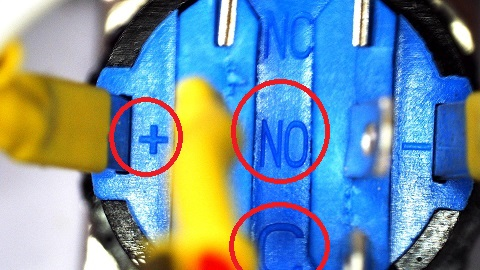

# IoT-Button-Notifier

ESP8266 and an LCD screen to make an interactive WiFi button.

Are you too engrossed at your computer to hear the doorbell ring? Use this simple device to get a popup on your computer whenever someone presses the button, then send a message back telling them to go away ( or you're that you'll be out soon, whichever suits.)

## Table of Contents

- [IoT-Button-Notifier](#IoT-Button-Notifier)
  - [Table of Contents](#Table-of-Contents)
  - [Bill of Materials](#Bill-of-Materials)
  - [Software and libraries](#Software-and-libraries)
  - [Connections and Assembly](#Connections-and-Assembly)
  - [Assembly](#Assembly)
  - [Programming](#Programming)
    - [PC Interface](#PC-Interface)
      - [Windows Install](#Windows-Install)
      - [Python library setup](#Python-library-setup)
      - [ESP Code](#ESP-Code)
      - [How it works](#How-it-works)
  - [Use](#Use)

## Bill of Materials

| Qty | Code                                    | Description        |
| --- | --------------------------------------- | ------------------ |
| 1   | [XC3802](http://jaycar.com.au/p/XC3802) | ESP8266 board      |
| 1   | [QP5521](http://jaycar.com.au/p/QP5521) | 16x2 Blue LCD      |
| 1   | [XC3706](http://jaycar.com.au/p/XC3706) | I2C port expander  |
| 1   | [SP0741](http://jaycar.com.au/p/SP0741) | Switch with LED    |
| 1   | [HB6213](http://jaycar.com.au/p/HB6213) | Enclosure          |
| 1   | [ZT2152](http://jaycar.com.au/p/ZT2152) | NPN transistor     |
| 1   | [PS0522](http://jaycar.com.au/p/PS0522) | DC socket          |
| 1   | [XC3850](http://jaycar.com.au/p/XC3850) | prototyping shield |
| 1   | [RR0595](http://jaycar.com.au/p/RR0595) | 9k resistor pack   |

## Software and libraries

| Arduino Library        | Author       | Version |
| ---------------------- | ------------ | ------- |
| LiquidCrystal_PCF8574  | mathertel    | 1.1.0   |
| ESP8266WiFi and others | ESPCommunity | default |

The python libraries to be installed on your computer after python3.7 has been installed:

| Python Library | Description                                  |
| -------------- | -------------------------------------------- |
| AppJar         | Used for building GUIs                       |
| requests       | For sending HTTP between computer and device |

## Connections and Assembly

The schematic is pretty easy to understand, as there's only 1 type of resistor and 3 components in total.


The first is the D5 Connection that is pulled up to 3.3V, with the switch pulling it down. If you need help, be sure to look over the assembly guide for pictures.

The Transistor has a resistor going from the base of the transistor to pin D6, this is to activate and de-activate the transistor, which will act as a gate (or a _low side switch_ ) to turn the LED on or off. We do it this way as the ESP cannot output 5v which we need to run the LED, but it can output a 3v3 signal to turn the transistor on/off. Remember to look for the positive and negative on the LED pins of the push button to make sure that you get it the right way around.

The ESP also connects to the [XC3706](https://jaycar.com.au/p/XC3706) port expander as well, via the D1 and D2 pins:

| ESP8266 | LCD Connector |
| ------: | ------------- |
|      D1 | SCL           |
|      D2 | SDA           |

The port expander is simply soldered onto the LCD as shown in the below pictures with the 4pin connector side facing outwards. To make this fit inside the case, we've bent the 4 pin connectors upwards, but if you have spare header pins it would be a cleaner job to remove them completely and put a 4 pin header there instead.


Back to the schematic, putting this on the [XC3850](https://jaycar.com.au/p/XC3850) prototyping shield is easy enough:


Here is the front side of what we've done. Pins of importance are highlighted and the connections on the underside are shown in green. We did use a 2 pin header to tap out the 5V and Ground, but that is up to you, as you can use any point of 5V and ground to provide the 5V power to the device.


Once these are soldered up, you can start to connect wires between the button, button LED, and some socket connections for the LCD port expander.

We've soldered some of the socket-socket leads onto the DC barrel jack:


Then we made sure that we know what we're connecting to `NO` and `C` on the button, plus the `+` and `-` for the LED.



## Assembly

Mark out where the LCD and the button are going on the top of the case and start to cut out. One easy way to do this is to place the LCD on the inside of the lid, then use a sharp knife or scribe to mark out where the LCD mount goes.

We've provided some measurements for you which should make things a bit easier.


Once the LCD and button are mounted together, and you've soldered some wires to the base prototyping board, you should get something similar to what's shown below.


This PCB should then fit right on top of the ESP when you solder sockets onto the ESP chip

**Important**
When connecting up the modules, make sure you have the positive and negative for the LCD the right way around. Getting it wrong will short out the regulator on the ESP.

## Programming

With this setup, there's two parts to the code, one part goes onto the ESP and the other remains on the PC to control it.

### PC Interface

Firstly, to use the PC interface, you must install python onto your PC. These instructions below are for Windows but you can install python on almost any computer, including a raspberry pi.

#### Windows Install

If you don't have python, you can download the installer here: https://www.python.org/downloads/release/python-372/

Most computers should be 64bit, so you should have no trouble installing that version.

Be sure to install **pip** along with the python install, it is enabled by default.


Once python is installed, open up command prompt by holding down the `Windows` key and pressing `r`.

in the window prompt that shows up, type in `cmd`


then in the cmd, type in the below command:

#### Python library setup

```sh
pip install appJar requests json
```

Wait for the packages to install. Once all the packages are installed, you should be able to double-click and run the `pc_interface.py`


The app might look a bit ugly, but it is super easy to modify, check out the python file:

```python
window = appJar.GUI()
# ...
window.addLabel('Device IP:')
window.addValidationEntry('addr')
window.addLabel('Current Message:')
# ...
window.addLabelEntry('line1')
window.addLabelEntry('line2')
window.setEntryMaxLength('line1',16)
window.setEntryMaxLength('line2',16)
window.addOptionBox('Blink', ['no blink', 'slow', 'fast'])
# ...
window.addButton('Send', buttonPress)
# ...
window.go()
```

#### ESP Code

The ESP code is a little harder and is in the `esp-button` folder

Always remember, if you have never programmed the ESP via Arduino before, follow the setup steps
as specified in the manual, found in the downloads tab of the [product page](http://jaycar.com.au/p/XC3802).

Use the Arduino Library Manager to install `LiquidCrystal_PCF8574`

Code overview is below, Be sure to change the **`NETWORK_SSID`** and the **`NETWORK_PW`** to your network name and password.

```cpp
#include <Wire.h>
#include <LiquidCrystal_PCF8574.h>
#include <ESP8266WiFi.h>
// ...
ESP8266WebServer server(80);
LiquidCrystal_PCF8574 lcd(LCD_ADDR);
// ...
void setup(){
  // ...
  lcd.print("Connect 2 netwrk");
  WiFi.mode(WIFI_STA);
  WiFi.begin(NETWORK_SSID, NETWORK_PW);

  lcd.setCursor(0,1);
  while(WiFi.status() != WL_CONNECTED){
    delay(500); lcd.print(".");
  }

  server.on("/lcd", HTTP_POST, [](){
    String t1 = server.arg("line1");
    String t2 = server.arg("line2");
    String opt = server.arg("opt");
    // ...
    server.send(200,"set");
  });
  server.on("/lcd", HTTP_GET, [](){
    String output = line1 + "<BR>" + line2;
    server.send(200, output.c_str());
  });
  // etc ...
}
```

#### How it works

We use an almost-REST style type of API, with HTTP status codes to control the flow of information between the pc interface and the ESP.

## Use

Once you have programmed the ESP to connect to the right network, and connected it all up properly, check both the serial monitor and the LCD screen to get information about how it's working. If it is all working as expected, you can disconnect the USB and run it of the barrel jack with a 5V connection.

Opening up the program, you can type in the device IP address, then set the two lines and blinking speed, then press send. If it all works correctly, you should see the changes on the device.
